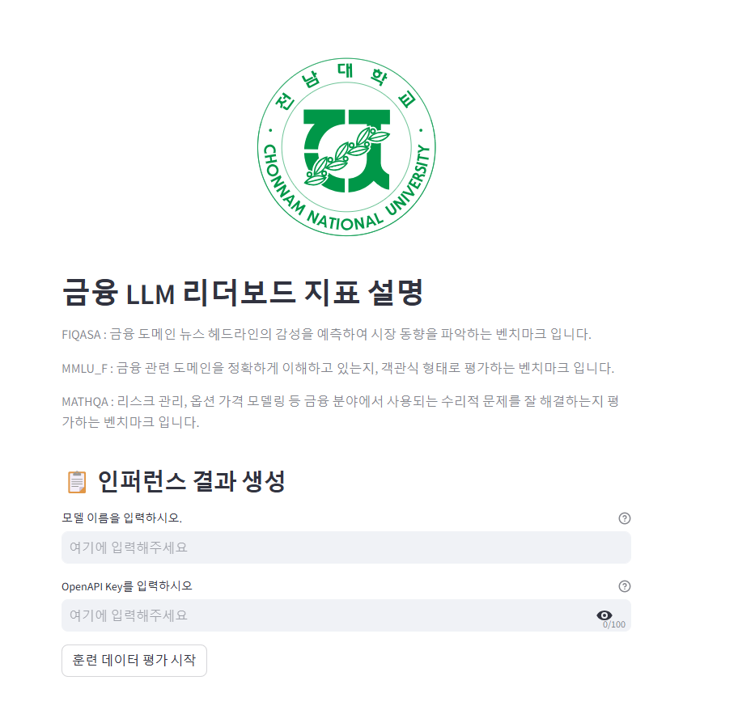

# Kor Finance Leaderboard
한국어 금융 LLM 리더보드

## 📖 Note
이번 전남대 해커톤에서 금융 LLM을 활용한 상담 챗봇 대회에서, 정량적인 평가를 위해 설계한 리더보드 입니다. 🎇
* 올거나이즈 금융 LLM 리더보드를 참고하여, 웹 사이트의 금융 뉴스 관련 헤드라인만 크롤링하여, FIQUSA를 구축하였습니다.
* 그리고, 다양한 세무ㆍ회계 자격증 기출문제를 통해 MMLU_F를 구축하였습니다.

## Repository
본 Repo는 Kor Finance Leaderboard 벤치마크의 추론 및 평가 코드, 데이터셋을 담고 있습니다.

## Evaluation Example
Chat gpt 활용, model_len 4096

### 1. 인퍼런스 결과 생성
```bash
python generator-openai-train.py
```

### 2. Judge 모델로 평가

#### OpenAI

```bash
python judgement-single.py -o gpt-3.5-turbo-0125.jsonl -k open-api key -t 30
```
### 3. 결과 확인

```bash
python score-single.py -p 평가결과.jsonl
```

### Streamlit
<p align="left" width="150%">

</p>
